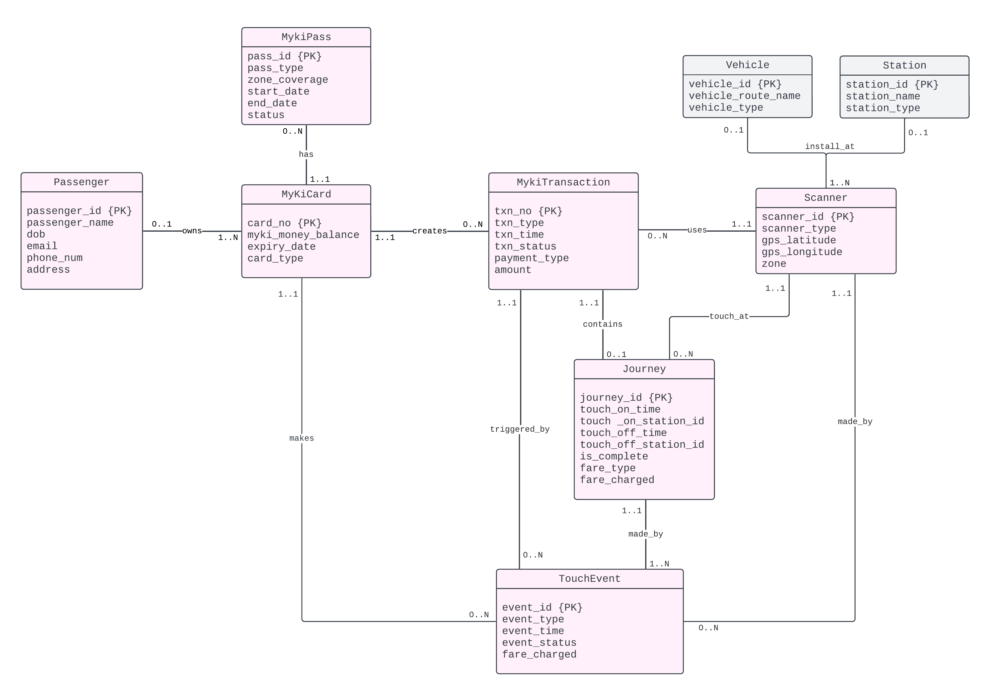
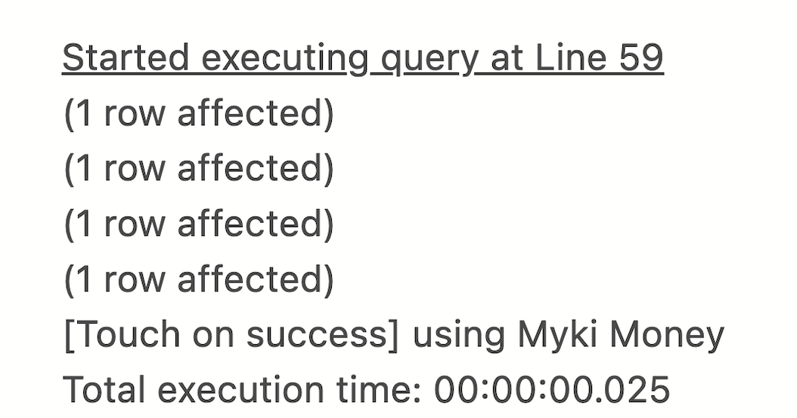

# Myki Card Database System<br>SQL Server Optimisation

A SQL Server transport card simulation project featuring T-SQL, partitioning, and indexing for performance optimisation.

---

## 🔧 Tech Stack

- Microsoft SQL Server 2022
- T-SQL (Stored Procedures & Queries)
- Azure Data Studio
- Partitioning Strategies
- Indexing Strategies
- ERD (UML)
- Normalisation (3NF)

---

## 📚 Key Features

- Simulates a public transport ticketing system
- Fully normalised schema with 9 interrelated tables (3NF)
- TouchOn logic implemented via T-SQL stored procedure
- Automated validation:
  - Card expiry check
  - Myki Pass detection
  - 2-hour window logic
  - Balance verification (Myki Money)
- Partitioned `TouchEvent` table by month for faster queries
- Indexed key columns to improve query performance
- Designed with scalability in mind (10k+ records/day)
- Error handling using TRY-CATCH and IF-ELSE in stored procedures

---

## 🗺️ Entity Relationship Diagram



---

## ▶️ How to Run

You can execute and explore the system through SQL Server and Azure Data Studio using the following scripts:

### 🔹 Step 1: Build Schema

```sql
-- Define database schema
RUN: sql/schema.sql
```

### 🔹 Step 2: Insert Sample Data

```sql
-- Load testing data
RUN: sql/data.sql
```

### 🔹 Step 3: Create Stored Procedure

```sql
-- Create the TouchOn logic
RUN: sql/TSQL.sql
```

### 🔹 Step 4: Run Demo

```sql
-- Simulate demo interactions
RUN: sql/demo.sql
```

📌 All scripts are written and tested on Microsoft SQL Server 2022 using Azure Data Studio.

---

## 🖼️ Demo Screenshots

The `touchOn()` stored procedure handles multiple edge cases and fare logic. Below are sample executions tested on SQL Server:

### 🔸 1. Expired Card (Should Fail)


### 🔸 2. Valid Myki Pass (Should Succeed)


### 🔸 3. Has Money, No Recent Travel (Should Charge Fare)



### 🔸 4. Has Money, Touched Within 2 Hours (No Extra Charge)


### 🔸 5. No Pass and No Money (Should Fail)


---

## 📂 File Structure

| Path                    | Purpose                                            |
|-------------------------|----------------------------------------------------|
| `sql/schema.sql`        | Database schema (tables, constraints)              |
| `sql/data.sql`          | Sample data for testing                            |
| `sql/TSQL.sql`          | Stored procedure `touchOn()` implementation        |
| `sql/demo.sql`          | Demo query script (for Week 8-9 presentations)     |
| `reports/ER_diagram.png` | UML-style ER diagram                          |
| `reports/database_design_report_s4055813.pdf` | Full design and optimisation report |

---

## 🧠 What I Learned

- Applied advanced SQL design for real-world transport system simulation
- Used partitioning and indexing for large-scale data optimisation
- Designed a stored procedure with multi-step validation and failover logic
- Structured and documented the system following industry best practices

---

## 📬 Contact

If you have any questions about the project or want to connect, feel free to reach out:

- GitHub: [github.com/minghsuan0317](https://github.com/minghsuan0317)
- LinkedIn: [linkedin.com/in/ming-hsuan-chen](https://www.linkedin.com/in/ming-hsuan-chen)


---

> **Note:**<br>This project was originally created for the **Database Applications** course at **RMIT** University, and was fully designed, implemented, and tested by me.
